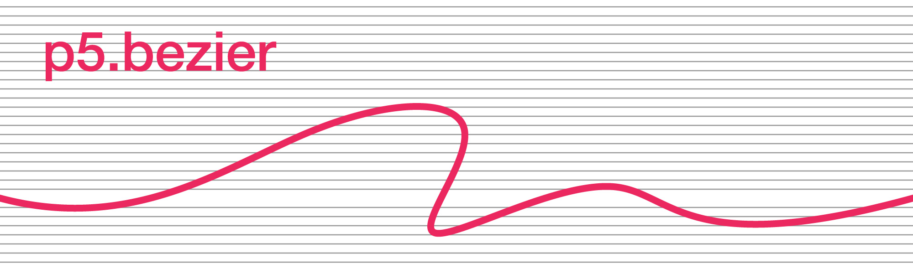
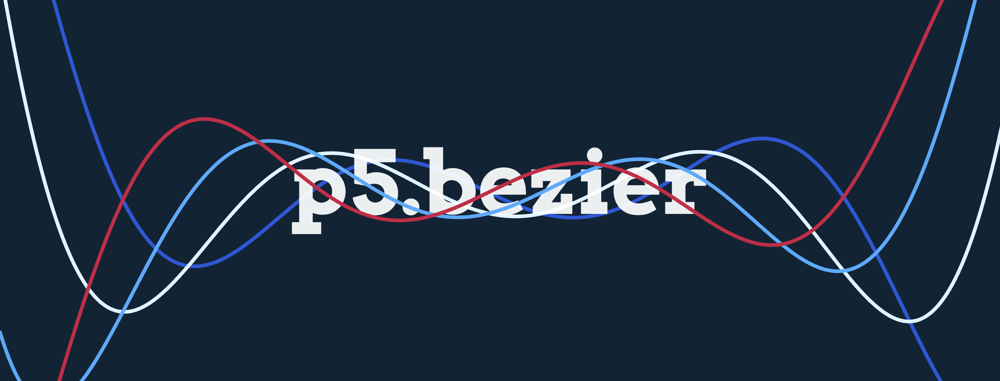

# p5.bezier



[](https://npmjs.org/package/p5bezier)
[](https://github.com/peilingjiang/p5.bezier/blob/main/LICENSE)
[](https://www.jsdelivr.com/package/npm/p5bezier)

**p5.bezier** is a [p5.js](https://p5js.org) library engineered to assist you in creating Bézier curves. It is an enhancement of the original p5.js `bezier()` function, extending its capabilities beyond the limitation of _four_ control points.

<!-- [**Try it now on p5.js Web Editor!**](https://editor.p5js.org/peilingjiang/sketches/7Z2pRG-TB) -->

[**Try it now on p5.js Web Editor!**](https://editor.p5js.org/peilingjiang/sketches/mVXzWEJbT) | [**Play with examples**](https://p5bezier.netlify.app)

While **p5.bezier** is designed to integrate with p5.js, it operates independently as well. To draw a Bézier curve on canvas, you can simply use `p5bezier.draw()`:

```js
let p5bezier = initBezier(canvas)

p5bezier.draw([
  [85, 20],
  [10, 10],
  [90, 90],
  [15, 80],
  [20, 100],
])
```

**What is a Bézier Curve?**

A Bézier curve is a type of curve that's widely used in computer graphics, design, etc. It was named after Pierre Bézier who employed it in car design during the 1960s. Due to its smooth and continuous nature, it's ideal for creating visually pleasing shapes and textures in various design fields.

## Getting Started

To use the p5.bezier library, first download the [p5.bezier.min.js](https://raw.githubusercontent.com/peilingjiang/p5.bezier/main/lib/p5.bezier.min.js) file and place it in your project directory. Then, include the following line in your HTML file:

```HTML
<script src="p5.bezier.min.js"></script>
```

Alternatively, you can use the library through a content delivery network (CDN):

```HTML
<script src="https://cdn.jsdelivr.net/npm/p5bezier@latest"></script>
```

Once included, you will have access to the `initBezier` function.

### NPM

You can also install the library using the package manager NPM (recommended):

```
npm install p5bezier
```

Then, import the initialization function into your project:

```js
import initBezier from 'p5bezier'
```

## Init for Bézier

You must initialize the Bézier drawing system with the canvas you are drawing on. Here's an example with p5.js:

```diff
function setup() {
  let c = createCanvas(100, 100)
+ let p5bezier = initBezier(c)
}
```

## Draw a Bézier Curve

The simplest way to use the library is to call `p5bezier.draw()` in your `draw()` function. You can adjust the curve's style using `fill()` or `strokeWeight()` just like other shapes.

```
p5bezier.draw(pointsArray [, closeType] [, smoothness]);
```

**pointsArray**

This is an array of [x, y] pairs, each representing a control point for the curve. For example, `[[10, 30], [5, 100], [25, 60]]`.

**closeType** (Optional)

This is a string, either `"OPEN"` or `"CLOSE"`. Use `"CLOSE"` to automatically close the curve. The default is `"OPEN"`.

**smoothness** (Optional)

This is an integer between `1` and `5`, with a default value of `3`. This value determines the smoothness of the Bézier curve. Higher values mean more vertices are used, leading to a more accurate and smoother curve, but at the cost of additional computation.

## Create a Bézier Object

For advanced operations, such as computing the shortest distance from a point to the curve, use the `p5bezier.new()` function. This method can also potentially optimize computation resources if placed within the `setup()` function, as vertices are calculated only once and can then be reused.

The usage of `p5bezier.new()` is similar to `p5bezier.draw()`, but it returns a _Bézier Curve Object_ that can be stored in a variable:

```
const bezierObject = p5bezier.new(pointsArray [, closeType] [, smoothness]);
```

The call of `p5bezier.new` will not draw the curve on canvas automatically. To draw the curve, use `.draw()` as one of many functions listed below:

- `.draw([dash])`

  Renders the curve on the canvas.

  **dash** (Optional)

  Accepts an array of two numbers specifying the length of solid and broken sections of a dashed Bézier curve. For example, `[10, 5]` signifies a solid segment of 10px followed by a 5px break.

- `.update(newPointsArray)`

  Updates the positions of control points. The number of control points should remain consistent with the initial curve configuration.

- `.move(x, y [, z, toDraw, dash])`

  Translates the entire curve. This function does not modify the original object but instead generates and returns a new one. Hence, if you wish to update the curve using this method (which is faster than `.update()`), you may:

  ```js
  bezierObject = bezierObject.move(6, 17, -22, false)
  ```

  By default, `toDraw` is set to `true`. However, if you wish to only update the curve without drawing it, you can set this parameter to `false`.

- `.shortest(pointX, pointY [, pointZ])`

  Requires the _x_ and _y_ coordinates of an external point as input. It returns an array containing the coordinates of the nearest point on the curve. For instance, to draw a line between these two points:

  ```js
  pointOnCurve = bezierObject.shortest(pointX, pointY)
  line(pointX, pointY, pointOnCurve[0], pointOnCurve[1])
  ```

## Examples



Check out the [examples page](https://p5bezier.netlify.app) and their [source code](https://github.com/peilingjiang/p5.bezier/tree/main/examples/).

### Projects and Demos

- [**Hair**](https://no-loss.netlify.app/), a visualization. See the source code at https://github.com/peilingjiang/hair.
- _p5.bezier Example - Basic_ on [CodePen](https://codepen.io/peilingjiang/pen/ZEOLVPx).
- _p5.bezier Example - Animation_ on [CodePen](https://codepen.io/peilingjiang/pen/eYMRJax).

## TODOs

1. More examples
2. `offset()`, `intersection()`, and `curvature()`... functions for Bézier object
3. Draw B-Spline curves

## References

- [Bézier curve - Wikipedia](https://en.wikipedia.org/wiki/B%C3%A9zier_curve)
